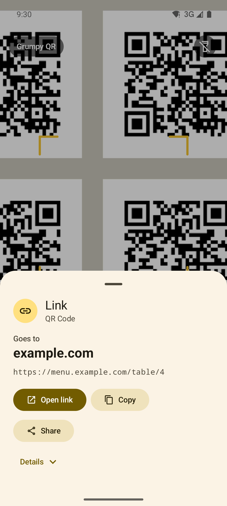
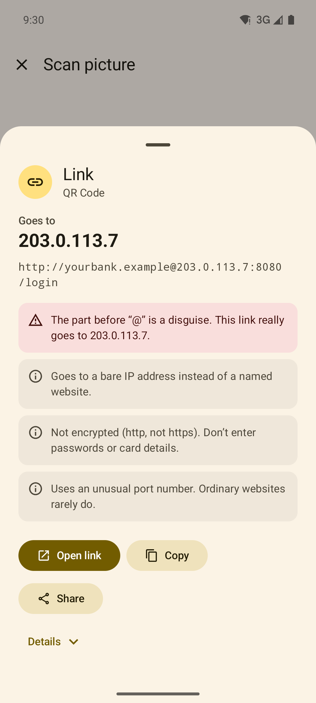
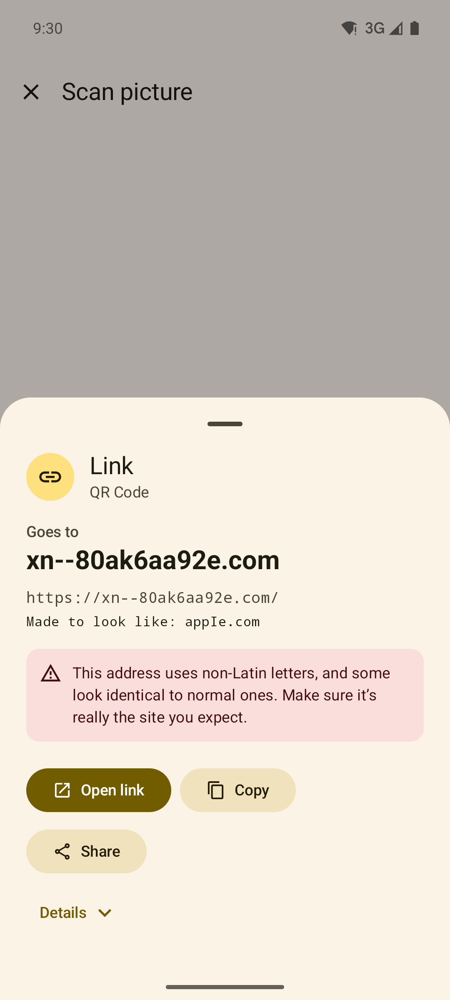
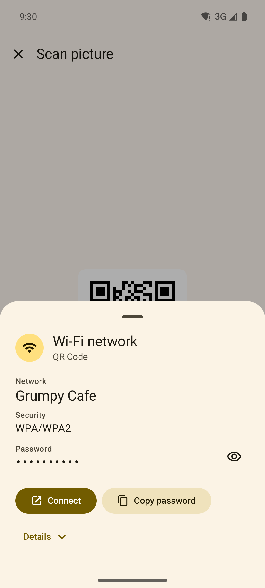
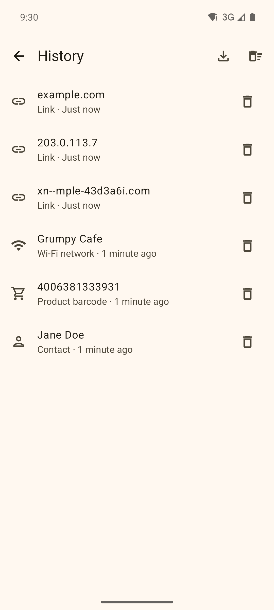

<p align="center">
  
</p>

<h1 align="center">Grumpy QR Reader</h1>
<p align="center"><b>A QR reader. That's it.</b></p>

<p align="center">
  <a href="https://github.com/nimbice/grumpy-qr/releases/latest/download/grumpy-qr.apk"></a>
</p>
<p align="center">
  <a href="https://github.com/nimbice/grumpy-qr/releases/latest/download/grumpy-qr.apk"><b>Download grumpy-qr.apk</b></a> · Android 8.0 or newer · <a href="#get-it">how to install and verify</a>
</p>

<p align="center">
  
  
</p>

Most free QR scanners make you sit through ads, ask for permissions they have no business asking for, and quietly track what you scan, all to read a few dozen characters off a square. Some have gone further and [turned into malware with a single update](https://www.malwarebytes.com/blog/news/2021/02/barcode-scanner-app-on-google-play-infects-10-million-users-with-one-update).

**Grumpy QR** is the opposite. No ads, no trackers, no accounts, no in-app purchases. It doesn't even have permission to use the internet, so it couldn't phone home if it wanted to. Every release is checked with [`tools/check-permissions.sh`](tools/check-permissions.sh), which fails if anything beyond the camera sneaks in.

<p align="center">
  
  
  
  
  
</p>

## Features

- **Live scanning** with CameraX: pinch to zoom, tap to focus, flashlight, inverted (light-on-dark) codes, several codes in one frame.
- **Scan pictures, screenshots and PDFs** with the system photo picker or file picker. No storage permission.
- **Share to scan:** share any picture, screenshot or PDF from another app to Grumpy QR. It shows up in the share sheet as "Scan QR code".
- **See where links really go** before you open them. The real site is shown big and bold, with offline notes on link shorteners, lookalike (homograph) addresses, `user@host` disguises, plain `http`, bare IP addresses, odd ports, and hidden or right-to-left characters. Dangerous schemes (`javascript:`, `intent:`, `file:` and so on) are never opened. Links never open on their own.
- **Does the obvious thing** with each type of code, using apps you already have: Wi-Fi (one-tap connect on Android 11+), contacts (vCard/MECARD), calendar events, email, phone, SMS, maps, product barcodes and ISBNs.
- **Payment codes** (UPI, EPC/GiroCode, Swiss QR-bill, Bitcoin and other crypto URIs) are laid out field by field with a "check who you're paying" note.
- **Careful with sensitive content:** two-factor (`otpauth://`) codes, passkey (`FIDO:/`) codes and things that look like crypto recovery phrases are flagged, hidden until you ask, copied as "sensitive", and never saved to history.
- **History that stays on the phone:** excluded from backups, can be turned off, exported as CSV or cleared.
- **Integrations:** Quick Settings tile, launcher shortcuts, and the classic `com.google.zxing.client.android.SCAN` intent so other apps can use Grumpy QR as their scanner. It always shows which app it's scanning for.
- Reads QR, Micro QR, rMQR, Data Matrix, Aztec, PDF417, MaxiCode, EAN/UPC, Code 128/39/93, Codabar, ITF, GS1 DataBar and more via [zxing-cpp](https://github.com/zxing-cpp/zxing-cpp).

## Permissions

| Permission | Why | When |
|---|---|---|
| Camera | Live scanning | Asked once, when you first open the scanner. Say no and it never asks again; you can still scan pictures. |

That's the whole list. The APK also declares one internal, signature-level permission (`…DYNAMIC_RECEIVER_NOT_EXPORTED_PERMISSION`) that AndroidX uses to protect the app's own broadcasts. Users never see it and no other app can hold it.

You can check any APK yourself:

```bash
aapt2 dump permissions grumpy-qr.apk
```

## Get it

- **Download:** [grumpy-qr.apk](https://github.com/nimbice/grumpy-qr/releases/latest/download/grumpy-qr.apk) (Android 8.0 or newer). Open it on your phone to install. The first time, Android asks you to allow installs from your browser or file manager. Older versions and SHA-256 checksums are on the [releases page](https://github.com/nimbice/grumpy-qr/releases).
- **Verify it (optional):** every APK is signed with the same key. Its certificate SHA-256 fingerprint is
  `20:01:7B:DF:BC:94:2A:4D:61:95:76:41:61:BF:C5:7B:74:45:E1:7B:8C:98:16:90:CD:A9:23:CF:59:B3:69:66`.
  Check it with `apksigner verify --print-certs grumpy-qr.apk` or the [AppVerifier](https://github.com/soupslurpr/AppVerifier) app.
- **Google Play:** coming soon.

## Build it yourself

You need JDK 17 or newer (21 recommended) and the Android SDK with platform 37 (Android Studio installs both).

```bash
./gradlew assembleDebug              # app/build/outputs/apk/debug/
./gradlew testDebugUnitTest lintDebug
```

Release builds are signed if a `keystore.properties` file exists in the project root (it's git-ignored):

```properties
storeFile=/absolute/path/to/release.jks
storePassword=...
keyAlias=...
keyPassword=...
```

To regenerate the store icon and feature graphic after changing the logo: `pip install pillow`, then `python tools/store_assets.py`.

## How it's put together

| Path | What's there |
|---|---|
| `content/` | Plain Kotlin, no Android: turns raw text into links, Wi-Fi, contacts, events, payments and so on, plus the offline link checker. Unit-tested. |
| `scan/` | zxing-cpp decoding for camera frames, pictures and PDFs. |
| `ui/` | Jetpack Compose screens: scanner, result sheet, history, settings. |
| `Actions.kt` | Every hand-off to another app goes through a standard intent, which is why no contacts, calendar, phone or location permissions are needed. |
| `AndroidManifest.xml` | The share target, the ZXing scan intent, the tile, and the lines that strip network permissions. |

Dependencies are deliberately few: AndroidX (Core, Activity, Lifecycle, Compose, CameraX) and zxing-cpp. That's it.

## Prior art and thanks

Grumpy QR stands on the shoulders of [zxing-cpp](https://github.com/zxing-cpp/zxing-cpp) and the original [ZXing](https://github.com/zxing/zxing) project. If Grumpy QR isn't for you, [Binary Eye](https://github.com/markusfisch/BinaryEye) and the [Privacy Friendly QR Scanner](https://github.com/SecUSo/privacy-friendly-qr-scanner) are excellent, honest alternatives that helped shape this one.

## Contributing

Bug reports, especially codes that don't scan (attach the image!), and pull requests are welcome. Ground rules:

1. No network access, analytics, ads or tracking. Ever.
2. No new permissions unless there is truly no other way, and never for something an intent or system picker can do.
3. Keep it small. If a feature needs a settings screen of its own, it probably doesn't belong.

Security issues: see [SECURITY.md](SECURITY.md).

## License

[GPL-3.0](LICENSE). You're free to use, study, change and share Grumpy QR. If you distribute a modified version, you have to share its source code too, so nobody can take this, stuff it with ads and close it up.
